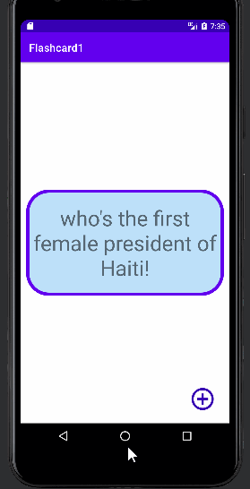

📝 `NOTE` Paste this template at the top of your existing `README.md` file from the last lab.

## Lab 2

### App Description
`TODO://` Add app description

### App Walk-though
`TODO://` 

 

`TODO://`

## Required
- [X] User can open the creation screen
- [X] User can cancel out of the creation screen
- [X] User can enter a new question and answer in the creation screen to then show it on the flashcard
- [X] Push code to GitHub
## Optional
- [ ] User gets an error if they try to create a new flashcard with no question or answer
- [ ] User can edit existing flashcard
- [ ] User can add multiple choice answers in the creation screen
